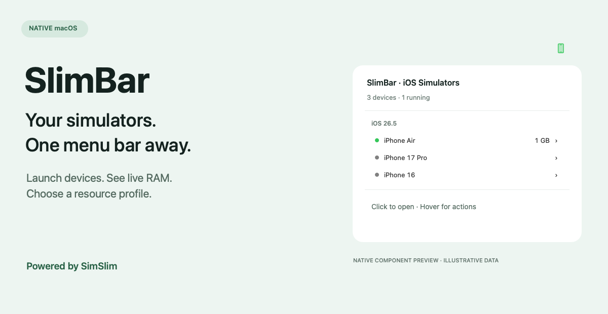

<div align="center">

# SlimBar

### Your iOS simulators. One menu bar away.

A native macOS menu bar app to launch simulators, watch their memory usage, and switch resource profiles without leaving your workflow.


**[Download](https://github.com/sky1095/SlimBar/releases/tag/v0.1.0) · [Get started](#get-started) · [Features](#features) · [Resource profiles](#resource-profiles) · [Build](#build-from-source) · [SimSlim](#powered-by-simslim)**

</div>



*Native component preview rendered from SlimBar's actual AppKit device rows and status icon, using illustrative device data. This is not a captured desktop screenshot or a memory benchmark.*

## Why SlimBar?

Simulator management should be a quick action, not a context switch. SlimBar puts your iOS devices in the menu bar, shows which ones are running, and brings SimSlim's service profiles into a native interface.

**SimSlim is included inside the app. You do not need Homebrew or a separate SimSlim installation to use SlimBar.** Full Xcode and an installed iOS simulator runtime are still required.

## Features

| Feature | What it does |
| --- | --- |
| **Click to launch** | Click a device name to boot it and open its Simulator window. Already-running devices use the same action. |
| **Organized device list** | Groups devices by iOS version, with running devices first within each group. Xcode parallel-testing clones are excluded. |
| **Live running status** | The menu bar icon turns green while a simulator is running. Device rows display running/stopped dots. |
| **Live RAM readings** | Shows the simulator-process memory footprint beside each running device, with process count in its submenu. Missing readings are explicitly marked unavailable. |
| **Three resource profiles** | Apply Stock, Everyday Development, or Minimal Testing from a device's submenu. |
| **Verified profile changes** | Confirms the chosen configuration after applying it, ensures the selected device is booted, and opens Simulator automatically. |
| **Compatibility checks** | Inspect whether the services needed for push notifications, StoreKit, and universal links are enabled. |
| **Same-row actions** | Hover over a device for Open, Shut Down, profiles, compatibility checks, and Copy UDID. |
| **Automatic refresh** | Refreshes on menu open and every three seconds, plus backend query time. Visible rows update without replacing the open menu. |
| **Clear operation state** | An animated menu bar spinner signals work in progress. Operations are serialized off the main UI thread. |
| **Remembered profile choice** | Stores the last profile applied by SlimBar locally, without claiming that external changes still match it. |
| **Actionable diagnostics** | Use Show Last Error to inspect backend failures; diagnostic output is kept separate from machine-readable results. |

## Get started

**Requirements:** Apple Silicon Mac, macOS 26 or later, full Xcode selected as the active developer directory, and at least one iOS simulator runtime installed through Xcode.

Download **SlimBar-v0.1.0-macos-arm64.zip** from the [v0.1.0 release](https://github.com/sky1095/SlimBar/releases/tag/v0.1.0), unzip it, and move `SlimBar.app` to `/Applications`. Alternatively, build from source below. SlimBar lives in the menu bar and does not add a Dock icon or enable launch at login.

1. Click the iPhone icon in the menu bar.
2. Click a device name to boot and open it.
3. Hover over a device to see RAM details, shut it down, copy its UDID, or choose a profile.
4. Review the confirmation before applying a profile. Applying can boot or reboot that device.
5. Choose **Stock** whenever you want to restore SimSlim-managed services.

This is an early public release. The app download and local builds use ad-hoc signing; they are not Developer ID signed or notarized. macOS may block the downloaded app pending explicit approval in System Settings → Privacy & Security. Only approve a copy you trust. Building from source is also supported.

## Resource profiles


*Profile reference illustration. The labels and descriptions come from the app; this image is not a screenshot of its submenu.*

| Profile | Services | Best suited to |
| --- | --- | --- |
| **Stock** | Re-enables all services managed by SimSlim. | Returning to the default SimSlim-managed service configuration. |
| **Everyday Development** | Keeps store, web, iCloud, contacts/calendar/mail, and Photos categories, plus explicit service labels needed by the three compatibility checks. Disables other managed categories, including Siri, widgets, Health, and HomeKit. | Development that needs those retained services. Test your own app's workflows. |
| **Minimal Testing** | Disables all SimSlim-managed services. Push, StoreKit, universal links, iCloud, Photos, and other features may stop working. | Basic UI work that does not depend on those services. |

Persistent slimming profiles require iOS 18.5 or newer. Stock remains available on older runtimes. A normal device click never silently applies slimming.

**Service checks are not end-to-end app tests.** They inspect disabled service overrides. Results expire after 60 seconds and are invalidated when SlimBar observes shutdown or service-count changes. Test notifications, purchases, authentication, links, and other features in your own app before relying on a profile.

RAM is a snapshot of simulator-process memory, not your app's memory alone. SlimBar does not promise a fixed percentage of memory savings. Results depend on runtime, workload, and profile.

## Build from source

```sh
git clone https://github.com/sky1095/SlimBar.git
cd SlimBar
./build.sh
open build/SlimBar.app
```

The first build downloads the official **SimSlim v0.9.0 macOS arm64** release, checks its pinned SHA-256 checksum, and bundles the executable inside `SlimBar.app`. Subsequent builds reuse the verified download. No separate backend installation is required. Internet access is needed for the first download.

The app is compiled directly with Xcode's Swift compiler; no package manager or Xcode project setup is needed. The build targets Apple Silicon/macOS 26 explicitly.

For backend development, an executable can be supplied explicitly:

```sh
SIMSLIM_CLI=/absolute/path/to/simslim ./build.sh
```

An override bypasses the pinned download; compatibility is your responsibility. At runtime, an explicitly set `SIMSLIM_CLI` takes precedence, followed by the bundled backend and then conventional Homebrew paths.

## Testing

Run the native AppKit regression checks after building:

```sh
SIMSLIM_CLI="$PWD/build/SlimBar.app/Contents/Resources/simslim" Tests/run.sh
```

The suite currently includes 38 assertions covering retained-menu updates, status colors, busy state, RAM formatting, compatibility validation and expiry, profile availability, exact-device targeting, command order, and failure handling. Python 3 is used by the test harness to assemble the test executable.

Read-only live checks:

```sh
build/SlimBar.app/Contents/MacOS/SlimBar --probe
build/SlimBar.app/Contents/MacOS/SlimBar --probe --features
```

Optional integration test, requiring the iOS 26.5 runtime and iPhone Air device type:

```sh
SIMSLIM_CLI="$PWD/build/SlimBar.app/Contents/Resources/simslim" \
  Tests/integration.sh --run-disposable-profile-cycle
```

This creates an empty simulator, checks Stock → Minimal → Everyday → Stock, and deletes that temporary device. It performs real service changes and reboots. Historical local validation is recorded in [VALIDATION.txt](VALIDATION.txt); it is not a support guarantee for every runtime.

## Troubleshooting

- **No devices listed:** install an iOS runtime in Xcode and create a simulator. SlimBar shows the default device set only.
- **Simulator cannot open:** check `xcode-select -p`. It should identify the full Xcode developer directory, not only Command Line Tools.
- **A feature stops working after slimming:** apply Stock, then retest. Compatibility checks cover three service groups, not every app capability.
- **RAM unavailable:** the backend did not return a usable measurement. This does not mean zero memory usage.
- **An action fails:** open Show Last Error and include the relevant message in your issue report.
- **An operation stays busy:** this release relies on backend deadlines and has no app-level cancellation/watchdog. If it does not recover, quit through Activity Monitor and reopen SlimBar. Check the device's actual state before retrying a profile change.

## Privacy

SlimBar has no account system or analytics code. It queries local simulator tools through the bundled backend and stores the last-applied profile locally in macOS preferences. Building from source downloads SimSlim from GitHub; opening documentation or support links takes you to GitHub. Review error output before posting it publicly.

## Current scope

SlimBar is iOS-only. Android, device creation/deletion, runtime installation, search, custom profiles, global shortcuts, launch at login, and automatic updates are not included. Intel builds and older macOS versions are not supported by the default build.

The native object tests do not replace hands-on keyboard, VoiceOver, menu interaction, animation, and Simulator window-focus testing. Broader runtime validation and resilient process cancellation remain areas for contribution.

## Powered by SimSlim

**A big shoutout to [SimSlim](https://github.com/MobAI-App/simslim) and its maintainers at [MobAI-App](https://github.com/MobAI-App).** Their work makes SlimBar's simulator management, service slimming, memory reporting, profile verification, and compatibility diagnostics possible.

SlimBar provides the native menu bar experience; **SimSlim is the bundled engine behind it**. This is an independent project, not an official SimSlim release or an implied endorsement.

If SlimBar helps your workflow, please **[star SimSlim](https://github.com/MobAI-App/simslim)**, try its tools, report backend issues upstream, and consider contributing to the project. Credit for the underlying slimming functionality belongs there.

SimSlim is distributed under the MIT license. Its copyright, license, Go runtime notice, and dependency notices are preserved in [THIRD-PARTY-NOTICES.txt](THIRD-PARTY-NOTICES.txt) and included inside the app bundle.

## Contributing and support

Bug reports and focused improvements are welcome. See [CONTRIBUTING.md](CONTRIBUTING.md) for setup and testing.

- [Report a SlimBar issue](https://github.com/sky1095/SlimBar/issues)
- [Propose a change](https://github.com/sky1095/SlimBar/pulls)
- [Visit SimSlim upstream](https://github.com/MobAI-App/simslim)

## License

SlimBar is [MIT licensed](LICENSE). Bundled third-party software retains its own copyright and applicable license notices.
