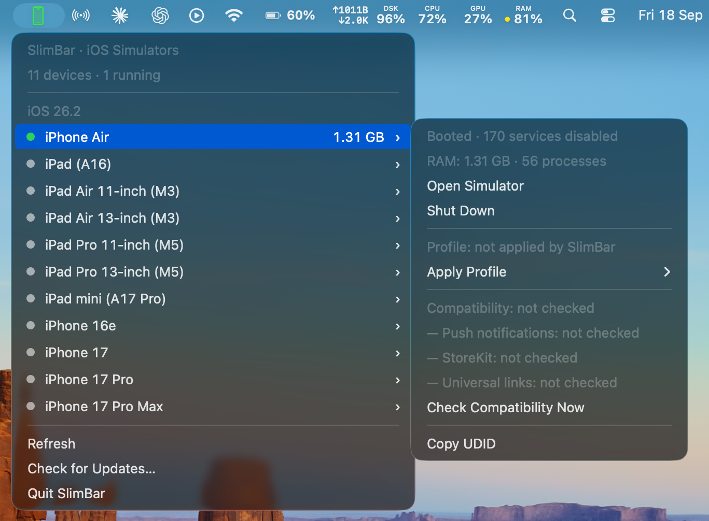
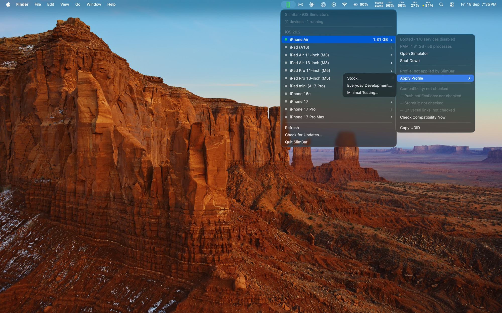
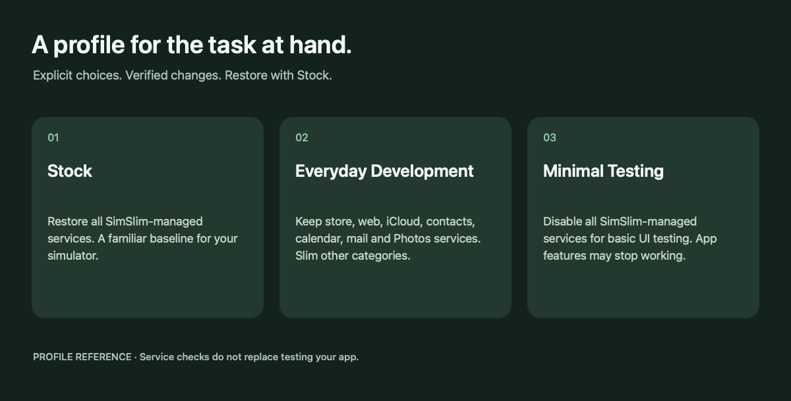

<div align="center">

# SlimBar

### Your simulators. One menu bar away.

A native macOS menu bar app to launch simulators, watch their memory usage, and switch resource profiles without leaving your workflow.


**[Download](https://github.com/sky1095/SlimBar/releases/tag/v1.1.0) · [Get started](#get-started) · [Features](#features) · [Resource profiles](#resource-profiles) · [Updates](#updates) · [Build](#build-from-source) · [SimSlim](#powered-by-simslim)**

</div>



*SlimBar with one simulator running. Devices are grouped by runtime, the booted iPhone Air carries a green dot and its live footprint, and its submenu shows state, RAM and per-device actions. The RAM figures are momentary snapshots of simulator-process memory, not a benchmark, and the compatibility rows read "not checked" until you run a check.*

## Why SlimBar?

Simulator management should be a quick action, not a context switch. SlimBar puts your iOS devices and Android AVDs in the menu bar, shows which ones are running, and brings SimSlim's and avdslim's service profiles into a native interface.

**SimSlim and avdslim are included inside the app. You do not need Homebrew or separate backend installations to use SlimBar.** Full Xcode and an installed iOS simulator runtime are still required for the iOS section; the Android SDK (emulator + adb) is required for the Android section.

## Features

| Feature | What it does |
| --- | --- |
| **Click to launch** | Click a device name to boot it and open its Simulator window. Already-running devices use the same action. |
| **Organized device list** | Groups devices by iOS version, with running devices first within each group. Xcode parallel-testing clones are excluded. |
| **Live running status** | The menu bar icon turns green while a simulator is running. Device rows display running/stopped dots. |
| **Live RAM readings** | Shows the simulator-process memory footprint beside each running device, with process count in its submenu. Missing readings are explicitly marked unavailable. |
| **Three resource profiles** | Apply Stock, Everyday Development, or Minimal Testing from a device's submenu — SimSlim-backed on iOS, avdslim-backed on Android. |
| **Verified profile changes** | Confirms the chosen configuration after applying it, ensures the selected device is booted, and opens Simulator automatically. |
| **Compatibility checks** | Inspect whether the services needed for push notifications, StoreKit, and universal links are enabled. |
| **Same-row actions** | Hover over a device for Open, Shut Down, profiles, compatibility checks, and Copy UDID. |
| **Android AVDs** | Lists AVDs from the Android SDK with running state, host RAM, boot options (Quick / Cold / Wipe Data), and avdslim profiles. The section hides itself when no SDK is found. |
| **Automatic refresh** | Refreshes on menu open and every three seconds, plus backend query time. Visible rows update without replacing the open menu. |
| **Clear operation state** | An animated menu bar spinner signals work in progress. Operations are serialized off the main UI thread. |
| **Remembered profile choice** | Stores the last profile applied by SlimBar locally, without claiming that external changes still match it. |
| **Actionable diagnostics** | Backend failures are named on the status row itself; hover it for the full output. Diagnostic output is kept separate from machine-readable results. |
| **Over-the-air updates** | Checks the project's GitHub release feed through Sparkle and installs signature-verified updates in place. |

## Get started

**Requirements:** Apple Silicon Mac, macOS 26 or later, full Xcode selected as the active developer directory, and at least one iOS simulator runtime installed through Xcode. For the Android section: the Android SDK with emulator and adb (Android Studio installs both; SlimBar looks in `ANDROID_HOME`/`ANDROID_SDK_ROOT`, `~/Library/Android/sdk`, and `PATH`).

Download **SlimBar-v1.1.0-macos-arm64.dmg** from the [v1.1.0 release](https://github.com/sky1095/SlimBar/releases/tag/v1.1.0), open it, and drag SlimBar to Applications. Alternatively, build from source below. SlimBar lives in the menu bar and does not add a Dock icon or enable launch at login.

1. Click the iPhone icon in the menu bar.
2. Click a device name to boot and open it.
3. Hover over a device to see RAM details, shut it down, copy its UDID, or choose a profile.
4. Review the confirmation before applying a profile. Applying can boot or reboot that device.
5. Choose **Stock** whenever you want to restore SimSlim-managed services.

The download is Developer ID signed, notarized by Apple, and stapled, so it opens with no Gatekeeper warning and needs no trip to System Settings → Privacy & Security. The `.zip` attached to the same release is what the in-app updater installs; you do not need to download it yourself. Builds you make from source are ad-hoc signed unless you supply your own signing identity.

## Resource profiles

The iOS profiles below are SimSlim service profiles. Android AVDs offer the same three names, backed by avdslim (see [Android support](#android-support)).



*Choosing a profile from a device's submenu. The menu bar icon is green because a simulator is running, and "Profile: not applied by SlimBar" means SlimBar has not applied one to this device — it does not claim the simulator is untouched.*



*Profile reference illustration. The labels and descriptions come from the app; this image is not a screenshot of its submenu.*

| Profile | Services | Best suited to |
| --- | --- | --- |
| **Stock** | Re-enables all services managed by SimSlim. | Returning to the default SimSlim-managed service configuration. |
| **Everyday Development** | Keeps store, web, iCloud, contacts/calendar/mail, and Photos categories, plus explicit service labels needed by the three compatibility checks. Disables other managed categories, including Siri, widgets, Health, and HomeKit. | Development that needs those retained services. Test your own app's workflows. |
| **Minimal Testing** | Disables all SimSlim-managed services. Push, StoreKit, universal links, iCloud, Photos, and other features may stop working. | Basic UI work that does not depend on those services. |

Persistent slimming profiles require iOS 18.5 or newer. Stock remains available on older runtimes. A normal device click never silently applies slimming.

**Service checks are not end-to-end app tests.** They inspect disabled service overrides. Results expire after 60 seconds and are invalidated when SlimBar observes shutdown or service-count changes. Test notifications, purchases, authentication, links, and other features in your own app before relying on a profile.

RAM is a snapshot of simulator-process memory, not your app's memory alone. SlimBar does not promise a fixed percentage of memory savings. Results depend on runtime, workload, and profile.

## Android support

The Android section lists every AVD from `emulator -list-avds`, grouped by API level parsed from each AVD's `config.ini`. Running state comes from `adb devices` plus the `sys.boot_completed` gate: an AVD visible to adb but not boot-complete reads **Booting**, never Booted. AVDs started outside SlimBar (Android Studio, terminal) are picked up by the same refresh.

| Action | Backend | Notes |
| --- | --- | --- |
| **Boot** | `emulator -avd <name>` | Launched detached; SlimBar confirms the AVD registers with adb within 30s. No slimming is applied silently. |
| **Boot options** | emulator flags | Quick Boot (defaults), Cold Boot (`-no-snapshot-load`), Wipe Data & Boot (`-wipe-data`, destructive — confirmed twice by wording). |
| **Shut Down** | `adb -s <serial> emu kill` | Verified by the serial leaving `adb devices`. The serial is re-resolved at action time so a stale menu cannot kill a neighbour. |
| **Apply Profile** | bundled avdslim | Stock → `avdslim off`; Everyday Development → `avdslim on`; Minimal Testing → `avdslim on --aggressive --no-anim`. The AVD boots first when needed. |
| **RAM** | host qemu RSS | Snapshot of the emulator-process footprint, attributed by qemu command line (single-process fallback only when unambiguous, otherwise explicitly unavailable). Same "momentary snapshot, not a benchmark" semantics as iOS. |
| **Copy AVD Name / Serial** | — | The AVD name is the stable identity; adb serials change across launches. |

Profile verification is coarser than on iOS: avdslim has no machine-readable verify, so SlimBar treats exit 0 plus a still-booted device with a readable footprint as applied, and the full backend output stays on the status row on failure. Compatibility checks are iOS-only (avdslim's doctor output is human-readable and is not parsed). For backend development, `AVDSLIM_CLI=/absolute/path/to/avdslim ./build.sh` overrides the pinned download, and a runtime `AVDSLIM_CLI` takes precedence over the bundled backend and Homebrew paths — mirroring `SIMSLIM_CLI`.

## Updates

SlimBar updates itself with [Sparkle](https://github.com/sparkle-project/Sparkle), reading an appcast published alongside each GitHub release. Every archive must carry a valid EdDSA signature, and because releases are Developer ID signed, Sparkle also refuses an update whose code signature does not match the running copy's team. Updates are delivered as the zip; the DMG is only the first-time download.

- **Check for Updates…** in the menu runs a check straight away.
- Sparkle asks once, on first launch, whether to also check automatically. To change that answer later, run `defaults write io.github.sky1095.slimbar SUEnableAutomaticChecks -bool true` (or `false`) and reopen SlimBar.
- A build made without a release signing key keeps the menu item disabled instead of accepting unverifiable downloads. A plain `./build.sh` produces such a build; see [CONTRIBUTING.md](CONTRIBUTING.md) for cutting a signed release.

## Build from source

```sh
git clone https://github.com/sky1095/SlimBar.git
cd SlimBar
./build.sh
open build/SlimBar.app
```

The first build downloads the official **SimSlim v0.9.0 macOS arm64** release, the official **avdslim v1.0.15 macOS arm64** release, and the official **Sparkle 2.10.0** release, checks all three against pinned SHA-256 checksums, and bundles the executables and the framework inside `SlimBar.app`. Subsequent builds reuse the verified downloads. No separate backend installation is required. Internet access is needed for the first download.

The app is compiled directly with Xcode's Swift compiler; no package manager or Xcode project setup is needed. The build targets Apple Silicon/macOS 26 explicitly.

A local build is ad-hoc signed. To sign it with your own Developer ID instead, which also enables the hardened runtime and a secure timestamp:

```sh
SIGNING_IDENTITY="Developer ID Application: Your Name (TEAMID)" ./build.sh
```

For backend development, an executable can be supplied explicitly:

```sh
SIMSLIM_CLI=/absolute/path/to/simslim ./build.sh
```

An override bypasses the pinned download; compatibility is your responsibility. At runtime, an explicitly set `SIMSLIM_CLI` takes precedence, followed by the bundled backend and then conventional Homebrew paths. The same holds for `AVDSLIM_CLI` and avdslim.

## Testing

Run the native AppKit regression checks after building:

```sh
SIMSLIM_CLI="$PWD/build/SlimBar.app/Contents/Resources/simslim" Tests/run.sh
```

The suite currently includes 145 assertions covering retained-menu updates, status colors, busy state, RAM formatting, compatibility validation and expiry, profile availability, exact-device targeting, command order, failure reporting, update-check availability, Android parsing/state/memory attribution, avdslim profile commands, the Android menu section, and the anonymous install, update, and error events. Python 3 is used by the test harness to assemble the test executable.

Optional integration test, requiring the iOS 26.5 runtime and iPhone Air device type:

```sh
SIMSLIM_CLI="$PWD/build/SlimBar.app/Contents/Resources/simslim" \
  Tests/integration.sh --run-disposable-profile-cycle
```

This creates an empty simulator, checks Stock → Minimal → Everyday → Stock, and deletes that temporary device. It performs real service changes and reboots. Historical local validation is recorded in [VALIDATION.txt](VALIDATION.txt); it is not a support guarantee for every runtime.

## Troubleshooting

- **No devices listed:** install an iOS runtime in Xcode and create a simulator. SlimBar shows the default device set only.
- **No Android section:** install the Android SDK (emulator + adb) and create an AVD. The section hides itself when no SDK is found; it is not an error.
- **Android profile rows disabled:** avdslim is missing. Reinstall SlimBar or point `AVDSLIM_CLI` at an avdslim executable. Listing and booting keep working without it.
- **Simulator cannot open:** check `xcode-select -p`. It should identify the full Xcode developer directory, not only Command Line Tools.
- **A feature stops working after slimming:** apply Stock, then retest. Compatibility checks cover three service groups, not every app capability.
- **RAM unavailable:** the backend did not return a usable measurement. This does not mean zero memory usage.
- **An action fails:** the status row names the failure. Hover it for the full backend output and include that in your issue report.
- **An operation stays busy:** this release relies on backend deadlines and has no app-level cancellation/watchdog. If it does not recover, quit through Activity Monitor and reopen SlimBar. Check the device's actual state before retrying a profile change.

## Privacy

SlimBar has no account system. It queries local simulator tools through the bundled backends (and the Android SDK's emulator/adb when present) and stores the last-applied profile locally in macOS preferences. Update checks fetch the appcast and release archives from GitHub, which sees the request as any download would; Sparkle only checks automatically if you agree to it on first launch. Building from source downloads SimSlim, avdslim, and Sparkle from GitHub; opening documentation or support links takes you to GitHub. Review error output before posting it publicly.

**Anonymous usage stats.** Official release builds send a few anonymous events to [PostHog](https://posthog.com) (US cloud): `app_installed` the first time SlimBar runs, `app_updated` the first time a new version runs, and `app_error` when an action or refresh fails. Every event carries a random ID generated on your Mac, the SlimBar version (plus the previous one, for updates), and the macOS version. Error events add only fixed labels: the action (for example `apply_profile_minimal` or `refresh`), iOS or Android, a failure category such as `timeout` or `command_failed`, and the tool and exit code when a command failed. The error text itself is never sent, so device and AVD names, UDIDs, serials, file paths, and command output stay on your Mac. Each distinct error is sent at most once per launch. Turn all of it off with **Share Anonymous Usage Stats** in the menu. Builds from source contain no PostHog key and send nothing.

## Current scope

SlimBar manages iOS simulators (via SimSlim) and Android emulators (via the SDK plus avdslim). Device creation/deletion, runtime/system-image installation, search, custom profiles, global shortcuts, and launch at login are not included. Intel builds and older macOS versions are not supported by the default build. Android compatibility checks are not included: avdslim's doctor output is human-readable and SlimBar does not parse it.

The native object tests do not replace hands-on keyboard, VoiceOver, menu interaction, animation, and Simulator window-focus testing. Broader runtime validation and resilient process cancellation remain areas for contribution.

## Powered by SimSlim

**A big shoutout to [SimSlim](https://github.com/MobAI-App/simslim) and its maintainers at [MobAI-App](https://github.com/MobAI-App).** Their work makes SlimBar's simulator management, service slimming, memory reporting, profile verification, and compatibility diagnostics possible.

SlimBar provides the native menu bar experience; **SimSlim is the bundled engine behind it**. This is an independent project, not an official SimSlim release or an implied endorsement.

If SlimBar helps your workflow, please **[star SimSlim](https://github.com/MobAI-App/simslim)**, try its tools, report backend issues upstream, and consider contributing to the project. Credit for the underlying slimming functionality belongs there.

SimSlim is distributed under the MIT license. Its copyright, license, Go runtime notice, and dependency notices are preserved in [THIRD-PARTY-NOTICES.txt](THIRD-PARTY-NOTICES.txt) and included inside the app bundle.

## Powered by avdslim

**A big shoutout to [avdslim](https://github.com/kdbhalala/avdslim) and its maintainer.** avdslim is the simslim-inspired Android counterpart SlimBar's AVD profiles are built on: launch slimming, bloat-daemon profiles, and host-memory tuning for the Android emulator.

SlimBar provides the native menu bar experience; **avdslim is the bundled engine behind Android profiles**. This is an independent project, not an official avdslim release or an implied endorsement.

If SlimBar's Android support helps your workflow, please **[star avdslim](https://github.com/kdbhalala/avdslim)**, try its CLI, and report backend issues upstream. Credit for the underlying slimming functionality belongs there.

avdslim is distributed under the MIT license. Its copyright and license are preserved in [THIRD-PARTY-NOTICES.txt](THIRD-PARTY-NOTICES.txt) and included inside the app bundle.

## Contributing and support

Bug reports and focused improvements are welcome. See [CONTRIBUTING.md](CONTRIBUTING.md) for setup and testing.

- [Report a SlimBar issue](https://github.com/sky1095/SlimBar/issues)
- [Propose a change](https://github.com/sky1095/SlimBar/pulls)
- [Visit SimSlim upstream](https://github.com/MobAI-App/simslim)

## License

SlimBar is [MIT licensed](LICENSE). Bundled third-party software retains its own copyright and applicable license notices.
